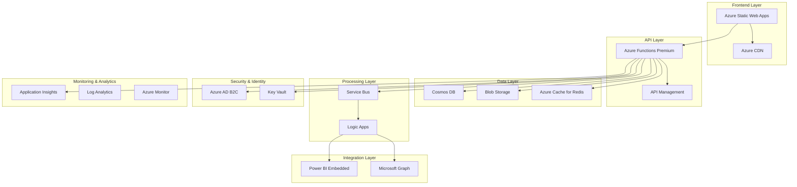

# Azure Services Integration Plan & Cost Estimation

## 5. Azure Services Integration Plan

### 5.1 Required Azure Services Architecture



### 5.2 Detailed Service Configurations

#### Azure Static Web Apps
```json
{
  "staticWebApp": {
    "name": "esg-data-platform",
    "sku": "Standard",
    "location": "Central US",
    "repositoryUrl": "https://github.com/MonikaSheoran/my-first-static-web-app2",
    "branch": "main",
    "buildProperties": {
      "appLocation": "/frontend",
      "apiLocation": "/api",
      "outputLocation": "/dist"
    },
    "customDomains": [
      "esg.company.com"
    ],
    "authentication": {
      "identityProviders": {
        "azureActiveDirectoryB2C": {
          "registration": {
            "clientId": "...",
            "clientSecretSettingName": "B2C_CLIENT_SECRET"
          }
        }
      }
    }
  }
}
```

#### Azure Functions Premium Plan
```bicep
resource functionAppPlan 'Microsoft.Web/serverfarms@2022-03-01' = {
  name: 'esg-functions-plan'
  location: location
  sku: {
    name: 'EP1'
    tier: 'ElasticPremium'
    family: 'EP'
    capacity: 1
  }
  kind: 'elastic'
  properties: {
    maximumElasticWorkerCount: 20
    reserved: false
  }
}

resource functionApp 'Microsoft.Web/sites@2022-03-01' = {
  name: 'esg-functions-app'
  location: location
  kind: 'functionapp'
  properties: {
    serverFarmId: functionAppPlan.id
    siteConfig: {
      appSettings: [
        {
          name: 'AzureWebJobsStorage'
          value: 'DefaultEndpointsProtocol=https;AccountName=${storageAccount.name};EndpointSuffix=${environment().suffixes.storage};AccountKey=${storageAccount.listKeys().keys[0].value}'
        }
        {
          name: 'COSMOS_CONNECTION_STRING'
          value: cosmosAccount.listConnectionStrings().connectionStrings[0].connectionString
        }
        {
          name: 'REDIS_CONNECTION_STRING'
          value: '${redisCache.properties.hostName}:${redisCache.properties.sslPort},password=${redisCache.listKeys().primaryKey},ssl=True,abortConnect=False'
        }
        {
          name: 'SERVICE_BUS_CONNECTION_STRING'
          value: serviceBusNamespace.listKeys().primaryConnectionString
        }
        {
          name: 'APPLICATIONINSIGHTS_CONNECTION_STRING'
          value: applicationInsights.properties.ConnectionString
        }
      ]
      cors: {
        allowedOrigins: [
          'https://esg-data-platform.azurestaticapps.net'
          'https://esg.company.com'
        ]
        supportCredentials: true
      }
      use32BitWorkerProcess: false
      netFrameworkVersion: 'v6.0'
      nodeVersion: '~18'
    }
    httpsOnly: true
    clientAffinityEnabled: false
  }
}
```

#### Azure Cosmos DB
```bicep
resource cosmosAccount 'Microsoft.DocumentDB/databaseAccounts@2023-04-15' = {
  name: 'esg-cosmos-db'
  location: location
  kind: 'GlobalDocumentDB'
  properties: {
    consistencyPolicy: {
      defaultConsistencyLevel: 'Session'
    }
    locations: [
      {
        locationName: location
        failoverPriority: 0
        isZoneRedundant: false
      }
    ]
    databaseAccountOfferType: 'Standard'
    enableAutomaticFailover: true
    enableMultipleWriteLocations: false
    capabilities: [
      {
        name: 'EnableServerless'
      }
    ]
  }
}

resource cosmosDatabase 'Microsoft.DocumentDB/databaseAccounts/sqlDatabases@2023-04-15' = {
  parent: cosmosAccount
  name: 'ESGDataPlatform'
  properties: {
    resource: {
      id: 'ESGDataPlatform'
    }
  }
}

resource filesContainer 'Microsoft.DocumentDB/databaseAccounts/sqlDatabases/containers@2023-04-15' = {
  parent: cosmosDatabase
  name: 'files'
  properties: {
    resource: {
      id: 'files'
      partitionKey: {
        paths: ['/organizationId']
        kind: 'Hash'
      }
      indexingPolicy: {
        indexingMode: 'consistent'
        includedPaths: [
          { path: '/*' }
        ]
        excludedPaths: [
          { path: '/processedData/*' }
        ]
      }
    }
    options: {
      throughput: 1000
    }
  }
}
```

#### Azure Cache for Redis
```bicep
resource redisCache 'Microsoft.Cache/redis@2023-04-01' = {
  name: 'esg-redis-cache'
  location: location
  properties: {
    sku: {
      name: 'Standard'
      family: 'C'
      capacity: 1
    }
    enableNonSslPort: false
    minimumTlsVersion: '1.2'
    redisConfiguration: {
      'maxmemory-policy': 'allkeys-lru'
    }
  }
}
```

#### Service Bus
```bicep
resource serviceBusNamespace 'Microsoft.ServiceBus/namespaces@2022-10-01-preview' = {
  name: 'esg-servicebus'
  location: location
  sku: {
    name: 'Standard'
    tier: 'Standard'
  }
  properties: {
    minimumTlsVersion: '1.2'
  }
}

resource processingQueue 'Microsoft.ServiceBus/namespaces/queues@2022-10-01-preview' = {
  parent: serviceBusNamespace
  name: 'file-processing'
  properties: {
    maxSizeInMegabytes: 1024
    defaultMessageTimeToLive: 'P1D'
    deadLetteringOnMessageExpiration: true
    maxDeliveryCount: 3
  }
}
```

### 5.3 Cost Estimation (Monthly)

#### Production Environment Costs

| Service | SKU/Tier | Estimated Usage | Monthly Cost (USD) |
|---------|----------|-----------------|-------------------|
| **Azure Static Web Apps** | Standard | 1 app, custom domain | $9.00 |
| **Azure Functions** | Premium EP1 | 1 instance, 8GB RAM | $146.00 |
| **Azure Cosmos DB** | Serverless | 10GB storage, 100K RU/s | $75.00 |
| **Azure Blob Storage** | Hot tier | 100GB storage, 10K transactions | $25.00 |
| **Azure Cache for Redis** | Standard C1 | 1GB cache | $55.00 |
| **Service Bus** | Standard | 1M operations | $10.00 |
| **Azure AD B2C** | Premium P1 | 1000 MAU | $3.00 |
| **Key Vault** | Standard | 1000 operations | $3.00 |
| **Application Insights** | Pay-as-you-go | 5GB data ingestion | $15.00 |
| **Azure CDN** | Standard Microsoft | 100GB egress | $8.00 |
| **API Management** | Developer | 1M calls | $50.00 |
| **Power BI Embedded** | A1 | 1 capacity | $750.00 |
| **Logic Apps** | Standard | 1000 executions | $20.00 |
| **Azure Monitor** | Pay-as-you-go | 10GB logs | $25.00 |

**Total Monthly Cost: ~$1,194.00**

#### Development Environment Costs

| Service | SKU/Tier | Estimated Usage | Monthly Cost (USD) |
|---------|----------|-----------------|-------------------|
| **Azure Static Web Apps** | Free | 1 app | $0.00 |
| **Azure Functions** | Consumption | 1M executions | $20.00 |
| **Azure Cosmos DB** | Serverless | 1GB storage, 10K RU/s | $8.00 |
| **Azure Blob Storage** | Hot tier | 10GB storage | $5.00 |
| **Azure Cache for Redis** | Basic C0 | 250MB cache | $16.00 |
| **Service Bus** | Basic | 100K operations | $0.05 |
| **Azure AD B2C** | Free | 50K MAU | $0.00 |
| **Key Vault** | Standard | 100 operations | $1.00 |
| **Application Insights** | Free | 1GB data ingestion | $0.00 |

**Total Monthly Cost: ~$50.05**

### 5.4 Cost Optimization Strategies

#### Reserved Instances
```json
{
  "reservedInstances": {
    "cosmosDb": {
      "term": "1 year",
      "savings": "20-30%",
      "estimatedSavings": "$180/year"
    },
    "functionApp": {
      "term": "1 year", 
      "savings": "20%",
      "estimatedSavings": "$350/year"
    }
  }
}
```

#### Auto-scaling Configuration
```typescript
// Cost optimization through intelligent scaling
export const scalingConfig = {
  functionApp: {
    scaleOutCooldown: '00:05:00',
    scaleInCooldown: '00:10:00',
    rules: [
      {
        metricName: 'CpuPercentage',
        threshold: 70,
        scaleAction: 'Increase',
        instanceCount: 1
      },
      {
        metricName: 'MemoryPercentage', 
        threshold: 80,
        scaleAction: 'Increase',
        instanceCount: 1
      },
      {
        metricName: 'HttpQueueLength',
        threshold: 100,
        scaleAction: 'Increase',
        instanceCount: 2
      }
    ]
  },
  cosmosDb: {
    autoscale: {
      maxThroughput: 4000,
      targetUtilization: 70
    }
  }
}
```

### 5.5 Service-to-Service Authentication

#### Managed Identity Configuration
```bicep
resource functionAppIdentity 'Microsoft.ManagedIdentity/userAssignedIdentities@2023-01-31' = {
  name: 'esg-function-identity'
  location: location
}

// Grant Function App access to Cosmos DB
resource cosmosRoleAssignment 'Microsoft.DocumentDB/databaseAccounts/sqlRoleAssignments@2023-04-15' = {
  parent: cosmosAccount
  name: guid(cosmosAccount.id, functionAppIdentity.id, 'DocumentDB Account Contributor')
  properties: {
    roleDefinitionId: '${cosmosAccount.id}/sqlRoleDefinitions/00000000-0000-0000-0000-000000000002'
    principalId: functionAppIdentity.properties.principalId
    scope: cosmosAccount.id
  }
}

// Grant Function App access to Key Vault
resource keyVaultAccessPolicy 'Microsoft.KeyVault/vaults/accessPolicies@2023-02-01' = {
  parent: keyVault
  name: 'add'
  properties: {
    accessPolicies: [
      {
        tenantId: subscription().tenantId
        objectId: functionAppIdentity.properties.principalId
        permissions: {
          secrets: ['get', 'list']
          certificates: ['get', 'list']
        }
      }
    ]
  }
}
```

### 5.6 Backup and Disaster Recovery

#### Backup Strategy
```json
{
  "backupStrategy": {
    "cosmosDb": {
      "continuousBackup": true,
      "pointInTimeRestore": "7 days",
      "geoRedundancy": true
    },
    "blobStorage": {
      "geoRedundantStorage": true,
      "softDelete": {
        "enabled": true,
        "retentionDays": 30
      },
      "versioningEnabled": true
    },
    "functionApp": {
      "sourceControl": "GitHub",
      "deploymentSlots": ["staging", "production"],
      "backupSchedule": "daily"
    }
  }
}
```

#### Disaster Recovery Plan
```typescript
// Disaster recovery automation
export class DisasterRecoveryService {
  async initiateFailover(): Promise<void> {
    // 1. Switch Cosmos DB to secondary region
    await this.cosmosService.initiateFailover('West US 2');
    
    // 2. Update DNS to point to secondary region
    await this.dnsService.updateRecords([
      { name: 'api', value: 'esg-functions-westus2.azurewebsites.net' }
    ]);
    
    // 3. Scale up secondary region resources
    await this.scalingService.scaleUp('westus2', {
      functionApp: 'EP2',
      cosmosDb: 2000
    });
    
    // 4. Notify stakeholders
    await this.notificationService.sendAlert({
      type: 'disaster_recovery',
      message: 'Failover to secondary region initiated',
      severity: 'high'
    });
  }
  
  async validateRecovery(): Promise<boolean> {
    const healthChecks = await Promise.all([
      this.healthService.checkFunctionApp(),
      this.healthService.checkCosmosDb(),
      this.healthService.checkBlobStorage(),
      this.healthService.checkRedisCache()
    ]);
    
    return healthChecks.every(check => check.status === 'healthy');
  }
}
```

### 5.7 Network Security Configuration

#### Virtual Network Integration
```bicep
resource vnet 'Microsoft.Network/virtualNetworks@2023-04-01' = {
  name: 'esg-vnet'
  location: location
  properties: {
    addressSpace: {
      addressPrefixes: ['10.0.0.0/16']
    }
    subnets: [
      {
        name: 'function-subnet'
        properties: {
          addressPrefix: '10.0.1.0/24'
          delegations: [
            {
              name: 'Microsoft.Web.serverFarms'
              properties: {
                serviceName: 'Microsoft.Web/serverFarms'
              }
            }
          ]
        }
      }
      {
        name: 'private-endpoint-subnet'
        properties: {
          addressPrefix: '10.0.2.0/24'
          privateEndpointNetworkPolicies: 'Disabled'
        }
      }
    ]
  }
}

// Private endpoint for Cosmos DB
resource cosmosPrivateEndpoint 'Microsoft.Network/privateEndpoints@2023-04-01' = {
  name: 'cosmos-private-endpoint'
  location: location
  properties: {
    subnet: {
      id: '${vnet.id}/subnets/private-endpoint-subnet'
    }
    privateLinkServiceConnections: [
      {
        name: 'cosmos-connection'
        properties: {
          privateLinkServiceId: cosmosAccount.id
          groupIds: ['Sql']
        }
      }
    ]
  }
}
```
